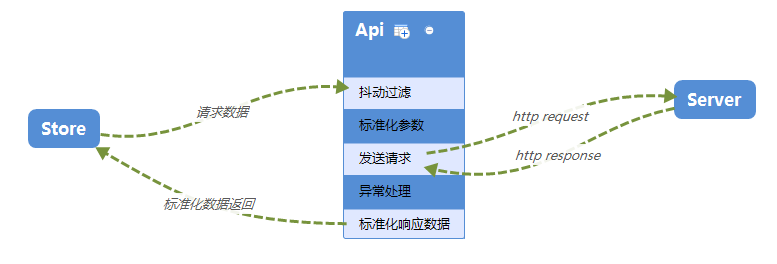

# API 管理



API 的功能一般是用于管理服务端的接口服务，从功能上面来看 API 要完成的事情大致是 1. 请求参数的加工 2. 发起接口的请求 3. 响应数据的处理 4. 请求异常处理

作为 MVVM 分层中关键的`M`层，我们希望`API`返回的内容都是标准化的，而接收的数据也是标准化的，我们不希望服务端接口或者是网络的不确定性漫延到我们的状态层。

## 请求参数的加工

一般情况下服务端接口的协议都很难完全信赖，或者是多个子系统间就有不一致的协议，例如下面两个是同一套系统中两个不同的列表获取接口


> 你永远不知道下一个列表接口是用的`POST`还是`GET`，而且一个是 URL 传参一个是 query 传参，两个程序的风格都很鲜明。

在这个点上`API`要做的事

1. 它只要告诉外面请求的是什么样的资源
2. 请求资源时要附带什么样的参数
3. 无论是增、删、改、查，API 给出来的接口都是一致的，它完全封装 HTTP 请求的参数细节，对外是始终如一的函数接口。

```js
// api/order.js
export async function list(filter, pageNumer, pageSize) {
  const url = `/api/order/list/${pageNumber}/${pageSize}` // <===
  axios.get(url, {                                        // <===
    params: {
      query: filter
    }
  })
}

// api/customer.js
export async function list(filter, pageNumer, pageSize) {
  const url = `/api/order/getOrders`                     // <===
  axios.get(url, {                                       // <===
    params: {
        pageNumber,
        pageSize,
        query:filter
    }
  })
}
```

> 统一的请求风格。

## 发起接口的请求

这个是`API`主要做的事情，但不仅仅是这个事情，很多同学会简单地把`发起http请求`直接写到`vuex`的`action`中，这是典型的管杀不管埋的玩法。

发起请求要做的事

1. 与服务端的约定处理（如添加 Authorization 到 header)
2. 超时处理，特定的长请求处理（如一般接口是 5S 超时，文件上传是 30S 超时）
3. 接口防抖

## 响应数据的处理

一般服务器返回的数据会包括业务数据、请求状态数据、异常信息等。

而我们应用层一般需要的是业务数据，部分请求状态数据（如列表分页信息），

## 请求异常处理

HTTP 调用的时候经常会抛出可预知或不可预知的异常，越是在靠近异常发生的位置处理异常，处理成本就越低。

## 小结

API 层可以认为是模型层，除了提供了模型外，它还为我们处理了数据请求过程中的大部分细节，让业务程更关注于业务的本身。
