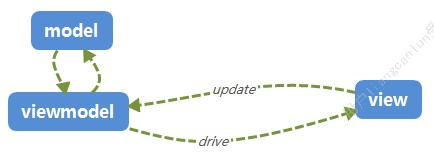

# 前端代码总体设计

**Author：BOWEN 2019-10-28**



## 代码分层

--src<br>
----api     (API层)<br>
----components (通用组件)<br>
----store   (状态层)<br>
----views   (视图层)<br>

## API

数据接口层，由它完成服务端`API`的调度,以及`API`相关的逻辑处理。

### 状态层特点：

1. 服务端接口的请求, 组装请求的URL和参数，设置请求相关的特殊字段。
2. 服务端数据的解包，如 `success`, `code` 与传输相关的字段处理，把真正要处理的数据给到调用方，并把相关的异常进行抛出。

`API` 层最大的特点是`面向接口`，完成前端APP与后端接口之前的数据对接，所以API的设计应该是能跟后端接口声明对应得上的。

```js
export async function saveOrder(orderId, orderData){
    const url = `/sys/order/save/${orderId}`
    const saveData = {id, ...updates}
    try{
        const {data, status} = await axios.put(url, orderData)
        if(status===200 && data.success){
            return data.result
        } else if(status!==200){
            throw Error(data.result)
        } else if(!data||!data.success){
            throw Error(data?data.msg:'服务端未知异常')
        }
    }catch(ex){
        throw Error('服务端异常:'+ex.message)
    }
}
```

## Store

状态层, 所以状态层是指前端业务逻辑层，该层一般会保持整个应用的状态数据，例如订单信息模块的订单列表数据、分页信息、搜索查询信息、当前先中的项目、当前编辑的项目信息、编辑更新等等。。。

一般来说只要是跟数据相关的状态信息应该都放在状态层，这样做的好处是可以精准地维护我们的数据状态，让前端编辑面向数据的维护并通过对状态的维护来驱动界面的更新。（MVVM的VM层）

### 状态层特点：

1. 面向数据开发而不是面向界面
2. 可以进行面向对象的封装，并可以引入类似[vuex-class](https://github.com/ktsn/vuex-class)进行更高效的面向对象封装
3. 状态层是`API`与`界面`层之间的桥梁，也可以认为是`API`和`界面`都是围绕状态层进行开发的。
4. 状态层才是真正前端应用的核心，它包括了前端大部分的逻辑处理代码，而`API`是对接口的封装、界面则是对用户交互的封装，它们最终都是服务于状态层。

```js
import Vue from 'vue'
import {getItem, getList, saveUpdate} from '../api/order'
import logger from '../utils/logger'

export default order{
    namespaced: true,
    state:{
        items:[], // 订单列表
        paging:{
            search:'',
            page:1,
            size:12,
            total:0
        },
        current:null,
        updates:{}
    },
    getters:{
        // 编辑的数据
        editData(state){
            return {...current, ...updates}
        },
        // 保存数据
        saveData(state){
            return {...current, ...updates}
        },
        // 当前是否有脏数据
        isDirty(state){
            return !! Object.keys(state.updates)
        }
    },
    mutations:{
        SET_ITEMS(state, items){
            state.items = items
        },
        SET_CURRENT(state, item){
            state.current = item
        },
        UPDATE(state, {prop, val}){
            Vue.set(state.updates, prop, val)
        },
        RESET(state){
            state.updates = {}
        }
    },
    actions:{
        async getList({commit, state}){
            try{
                const items = getItems(state.paging)
                commit('SET_ITEMS', items)
                commit('SET_CURRENT', items.find(i=>i.id===state.current.id)||null)
                commit('RESET')
            } catch(e){
                logger.error(e)
                throw e
            }
        },
        async getItem({commit, state}, id){
            try{
                const item = getItem(id)
                commit('SET_CURRENT', item)
                commit('RESET')
            } catch(e){
                logger.error(e)
                throw e
            }
        },
        async update({commit, state, getters, dispatch}){
            try{
                const result = saveUpdate(getters.saveData)
                if(result){
                    dispatch('getItem', state.current.id)
                }
            } catch(e){
                logger.error(e)
                throw e
            }
        }
    }
}
```

## View

用户视图层（或叫界面层），主要职责是完成对用户交互的显示和用户行为的收集，所以说它是面向用户和用户操作的。

### 视图层特点：

1. 面向用户交互和用户行为的开发
2. 类似验证、提示等的用户交互逻辑应该放在这层上面。
3. 仅限于用户交互逻辑，不应该包含太多的业务逻辑处理。
4. 与`状态层`做好严格分工，把`业务逻辑`放在状态层上,把`界面逻辑`尽量放在界面层上。
5. 把`VUE`的组件都作为视图层，因为一个`VUE`文件就是一个显示的单元。


## 小结

所谓代码分层目的就是把代码放在更合适的位置，按照[迪米特法则](https://baike.baidu.com/item/%E8%BF%AA%E7%B1%B3%E7%89%B9%E6%B3%95%E5%88%99/2107000?fr=aladdin),我们应该让每个模块做到更大限度的内聚性，降低外部访问的复杂度。

另外好的代码分层可以让代码具有更好的可测试性，我们可以对不同分层下面的代码进行更好的逻辑隔离测试，而且对于通用测试类的开发也更加的方便。

当然代码的每一层同时也应该要用统一的开发规范，例如标准的`API`处理模块要怎么写，按照什么样的规范来做。
