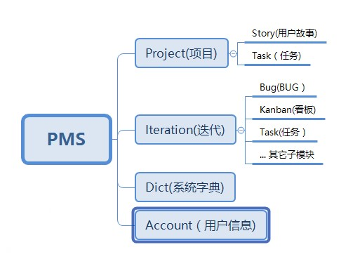

# 系统状态管理

当前讨论的状态管理特指`vuex`的状态管理，我们在管理状态时首先就是要想好什么是系统的状态，状态要怎么归类，那些是系统的状态那些不是。

## 什么是系统的状态

系统的状态可以认为是系统每个时刻的数据，举个例子汽车在路上跑，每个时间点的速度、油量、水温、轮胎汽压就是汽车的当前状态。

通常我们会把整个系统的状态看成一个整体，它可以管理到系统中每个数据的角落。

## 状态归类

通常系统的状态是按照业务实体进行面向对象的组织（如订单模型、商品模型。。。），所以在做状态层的模块化设计时我们首先要明确系统的整体设计是怎么样的，包含那些业务上的实体。

例如要做一个`PMS`(项目管理系统)，通常有`项目`、`用户故事`、`任务`、`迭代`、`Bug`这些业务实体，它的模型设计大概是如下



由上图可见，状态是可以多层次的，而而不同的层次之间甚至还可以重名，但为了方便维护我们的状态一般不要起过 3 层。

## 那些是系统的状态那些不是

在日常开发过程中很多人会疑惑那些特性属于状态层管理，那些不属于状态管理。

按照[单一职责原则](https://baike.baidu.com/item/%E5%8D%95%E4%B8%80%E8%81%8C%E8%B4%A3%E5%8E%9F%E5%88%99/9456515),我们的状态就应该只管理状态，那些`http`请求、界面的`loading`还有什么乱七八糟的缓存管理等等应该都不是由状态层来做。

按这么个出发点来看，状态应该就是管理业务实体的状态，那些是业务实体的状态？

1. 列表数据。
2. 详情的数据项（通常 TO B 的系统都是列表加编辑，所以是列表数据和详情数据）。
3. 选中元素的修改内容。
4. 当前元素的最新状态。
5. 列表分页状态。
6. 否有脏数据
   ......

那些不属于状态

1. loading 是否显示
2. 弹窗要不要显示
3. 当前要显示那些字段
4. 用户有没有权限访问按钮
   ......

### 为什么不让状态与页面一一对应

看起来很美妙，实际上则不然。

界面是面向交互细节做的设计，所以它是零碎而且不确定的（例如用户的详情界面可以是弹窗、页面甚至会同存在），对于用户端的设计一直都是不稳定的，甚至可能是每个迭代都会折腾，但我们的状态是相对稳定的业务实体。

如果按照界面开发我们可能会做好多个细化的状态来管理这些页面，但事实上`VUE`组件提供的`component`.`data`和`component`.`computed`特性刚好是能完成这些任务的，我们没必要过度封装状态层。

### 表单数据为什么要做到状态层

按照`vuex`官方的说法，表单的放在状态层是极其地不方便的，我们要在组件中写一组`getter`、`setter`来处理表单的`v-model`绑定。

但为什么仍要坚持把表单数据放在状态层？

1. 表单的逻辑是属于状态层，如数据的关联更新（类似修改用户名，更新用户的全名）
2. 放在状态层更方便我们对数据状态的跟踪，我们可以明确当前表单的修改状态，改了那些内容（类似`React`+`Redux`就是这么干的）

按目前看一切罪恶的源头是`v-model`这个语法糖，它把一个意向的数据流变成双向，让程序员更加无所适从。

## 一个典型的 VUEX 模型

```js
import Vue from 'vue'
import {getItem, getList, saveUpdate} from '../api/order'
import logger from '../utils/logger'

export default order{
    namespaced: true,
    state:{
        items:[], // 列表数据状态
        paging:{   // 分页加载状态
            search:'',
            page:1,
            size:12,
            total:0
        },
        current:null, // 当前编辑的数据状态
        updates:{}     // 当前的更新状态
    },
    getters:{
        // 编辑的数据
        editData(state){
            return {...current, ...updates}
        },
        // 保存数据(跟 editData 一样，但仍需要分开，因为一个是页面界面，一个是面向API)
        saveData(state){
            return {...current, ...updates}
        },
        // 当前是否有脏数据
        isDirty(state){
            return !! Object.keys(state.updates)
        }
    },
    mutations:{
        SET_ITEMS(state, items){
            state.items = items
        },
        SET_CURRENT(state, item){
            state.current = item
        },
        // 更新维护
        UPDATE(state, {prop, val}){
            Vue.set(state.updates, prop, val)
        },
        RESET(state){
            state.updates = {}
        }
    },
    actions:{
        async getList({commit, state}){
            try{
                const items = getItems(state.paging)
                commit('SET_ITEMS', items)
                commit('SET_CURRENT', items.find(i=>i.id===state.current.id)||null)
                commit('RESET')
            } catch(e){
                logger.error(e)
                throw e
            }
        },
        async getItem({commit, state}, id){
            try{
                const item = getItem(id)
                commit('SET_CURRENT', item)
                commit('RESET')
            } catch(e){
                logger.error(e)
                throw e
            }
        },
        async update({commit, state, getters, dispatch}){
            try{
                const result = saveUpdate(getters.saveData)
                if(result){
                    dispatch('getItem', state.current.id)
                }
            } catch(e){
                logger.error(e)
                throw e
            }
        }
    }
}
```
